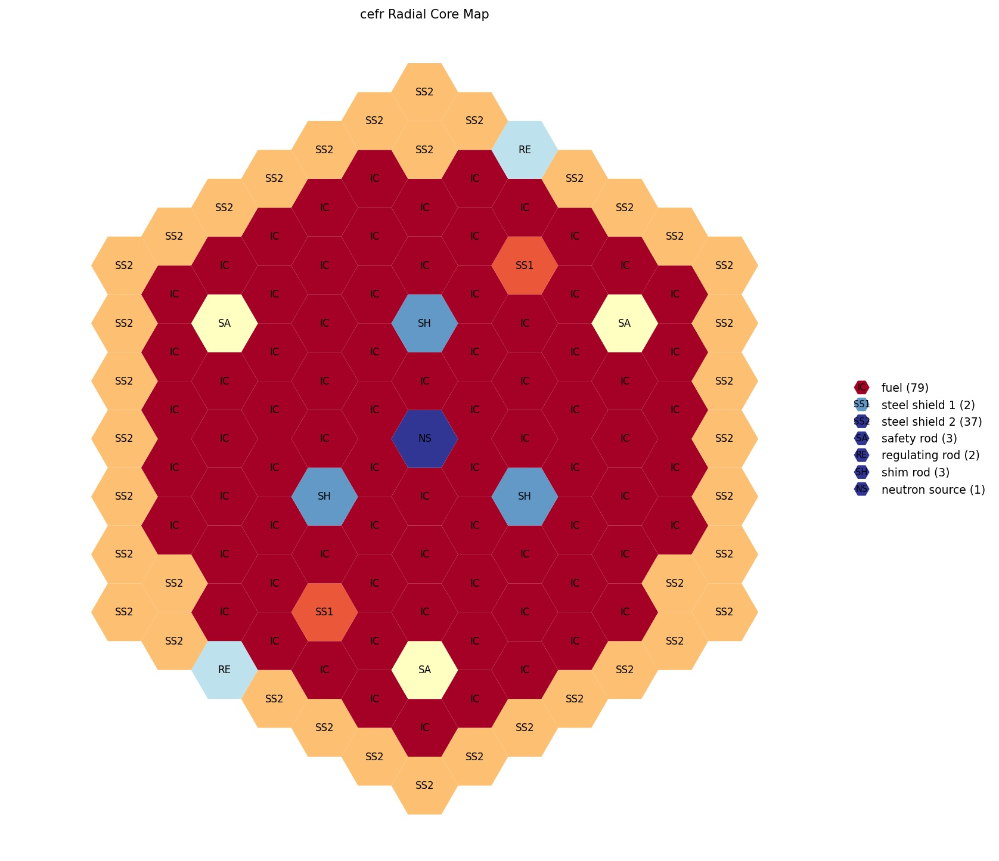

In 2018, the IAEA began an evaluation of the China Experimental Fast Reactor (CEFR)
startup tests [as a benchmark problem](https://www.iaea.org/zh/projects/crp/i31032)

This repo is intended to capture the benchmark specification in the form of
[ARMI](https://terrapower.github.io/armi/) input files which could be used
to execute the benchmark using a variety of approximations and physics models.

This is a incremental project and is not yet complete.

The initial core map comes from
https://www.epj-conferences.org/articles/epjconf/pdf/2021/01/epjconf_physor2020_10008.pdf

WARNING: At the moment, the core map is the only correct thing. The pin dimensions and
assemblies are inherited from an older ANL-AFCI-177 model.

